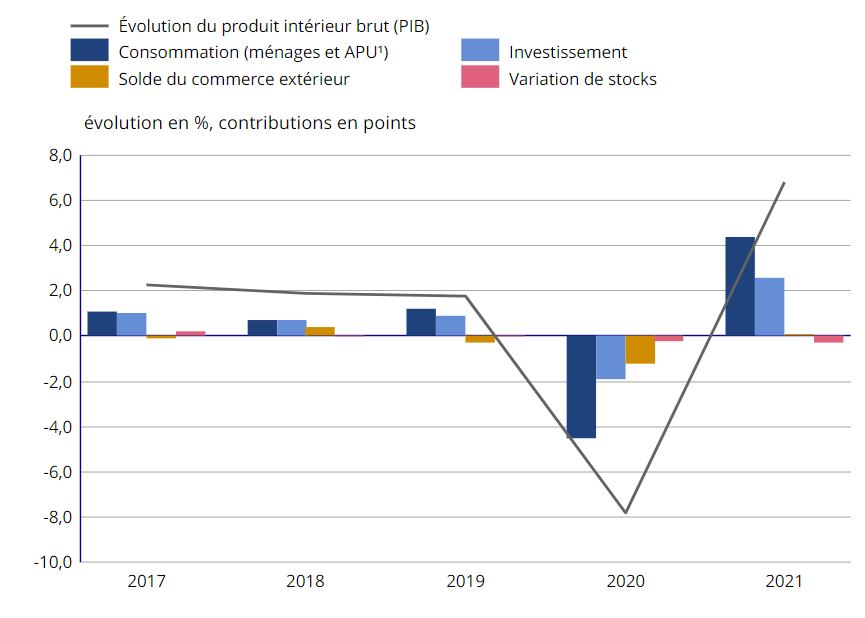

--- 
title: "MACROECONOMIE D2"
author: "Yann Thommen"
date: "`r Sys.Date()`"
site: bookdown::bookdown_site
---


# Les grandes fonctions macroeconomiques


*Évolution du PIB (France) en volume et contributions (source Insee)*

```{r echo=FALSE}
library(knitr)



```


Revenons à notre fonction de consommation des ménages. Elle dépend positivement du revenu disponible $Y_D$, tel que :