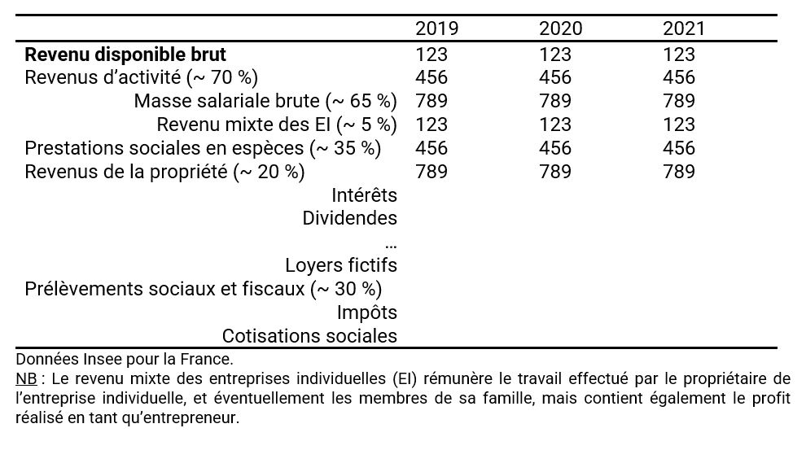
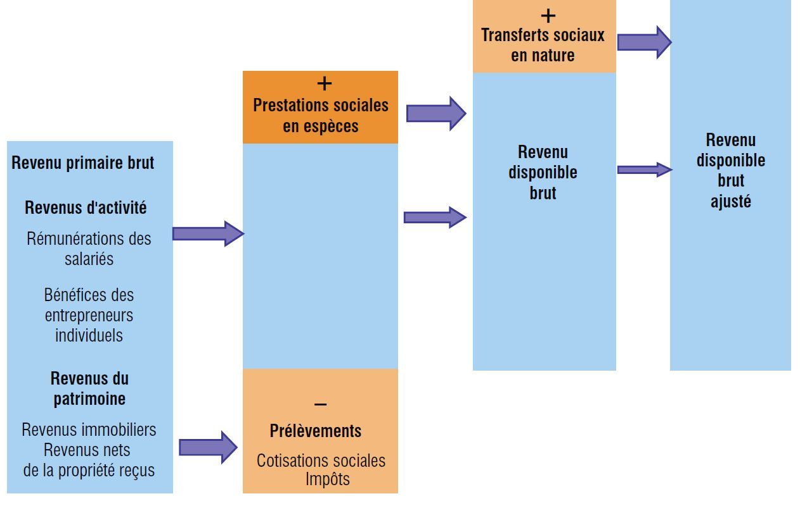
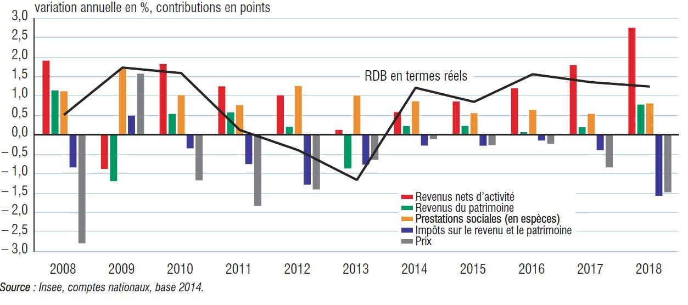
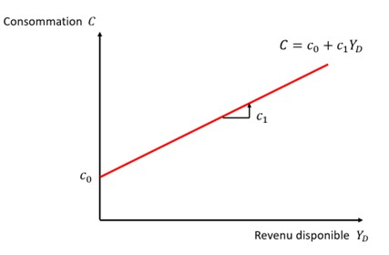

--- 
title: "MACROECONOMIE D2"
author: "Yann Thommen"
date: "`r Sys.Date()`"
site: bookdown::bookdown_site
---


# Les grandes fonctions macroeconomiques {-}


**GRAPHIQUE 1 : Évolution du PIB (France) en volume et contributions (source Insee)**

```{r echo=FALSE}
library(knitr)

knitr::include_graphics("images/pib_contributions.JPG")

```

## La consommation

### La consommation dans la comptabilité nationale 

La comptabilité nationale distingue 2 concepts de consommation finale pour les ménages :

—	La dépense de **consommation finale des ménages** : dépenses des ménages pour acquérir des biens et de services utilisés pour la satisfaction directe des besoins humains « individuels ». Il s’agit des dépenses de consommation pour lesquelles les ménages paient directement (« de leur proche »). 

—	La **consommation finale *effective* des ménages** : ensemble des biens et des services que les ménages consomment/utilisent, quelle que soit la manière dont ils sont financés (qu’ils aient payé ou non).  Elle comprend les remboursements de sécurité sociale, les aides au logement, les dépenses de la collectivité en éducation, en santé, etc. appelés les « transferts sociaux en nature des administrations », qui entrent dans la consommation finale des administrations publiques et/ou ISBLSM. 


### La fonction de consommation


**TABLEAU 1 : Decomposition du revenu disponible des ménages (France) (source Insee)**

```{r echo=FALSE}


```


**GRAPHIQUE 1 : Des revenus au revenu disponible brut ajusté**  

```{r echo=FALSE}


```


**GRAPHIQUE 2 : Contributions à l’évolution du pouvoir d’achat des ménages en France**


```{r echo=FALSE}


```


Keynes justifie les différents concepts qui régissent le comportement de consommation des ménages en pointant l’existence d’une « loi psychologique fondamentale », qu’il définit de la manière suivante :

> "La loi psychologique fondamentale, à laquelle nous pouvons faire toute confiance, à la fois a priori en raison de notre connaissance de la nature humaine et a posteriori en raison des enseignements détaillés de l’expérience, c’est qu’en moyenne et la plupart du temps les hommes tendent à accroître leur consommation à mesure que leur revenu croît, mais non d’une quantité aussi grande que l’accroissement du revenu" 
>
> --- John Maynard Keynes,  Théorie générale de l'emploi, de l'intérêt et de la monnaie (1936)


Revenons à notre fonction de consommation des ménages. Elle dépend positivement du revenu disponible $Y_D$, tel que :

\begin{equation}
C=C\left(Y_D\right),\ \ \ \ \ \ \ \ \ \ \ \ avec\ C\prime\left(Y_D\right)\ >\ 0
\end{equation}

Elle capture le comportement agrégé des ménages, et prend souvent la forme explicite de la fonction linéaire suivante :

\begin{equation}
C=c_0+c_1Y_D
\end{equation}

Avec :
	
$c_0>\ 0$ : la consommation dite « incompressible », c-à-d la consommation si $Y_D\ =\ 0$ (les ménages consomment alors en vendant des actifs ou en empruntant)
	
$ 0 <\ c_1 \< 1\$ : la propension marginale à consommer 

$Y_D\geq 0$ : le revenu disponible des ménages


```{r echo = FALSE}




```


### Les autres théories de la consommation

### Quelle politique de consommation ?

Lecture du billet de blog d’Agnès-Benassy Quéré : **Comment stimuler la consommation ?**

https://www.tresor.economie.gouv.fr/Articles/2020/10/07/comment-stimuler-la-consommation

Répondre aux questions suivantes :

1.	Pourquoi un haut niveau de consommation des ménages est essentiel dans une économie ?

2.	Est-ce que la consommation française est restée à un niveau suffisant, malgré la crise sanitaire ?

3.	Réfléchissez au concept de propension à consommer. Pourquoi serait-il différent entre les Français ?

4.	Comment interpréter le graphique 2 du premier texte ? Que signifie le -1% ?

5.	Quelles étaient les mesures possibles pour relancer la consommation ? Pour quelle efficacité a priori ?


## L'épargne

### L'épargne comme un résidu

### Le paradoxe de l'épargne 

### L'épargne des français

### Les déterminants de l'épargne 

## L'investissement 

### L'investissement dans la comptabilité nationale 

### Les déterminants de l'investissement

#### Le taux d'intérêt

#### La demande anticipée (principe de l'accélérateur)

#### Le coût du capital

#### La situation financière de l'entreprise 


### Le financement de l'investissement 

#### Politique monétaire et conditions de financement 

### L'investissement : un agrégat volatile 

#### L'exemple des NTIC

#### L'incertitude 

#### Irréversibilité


